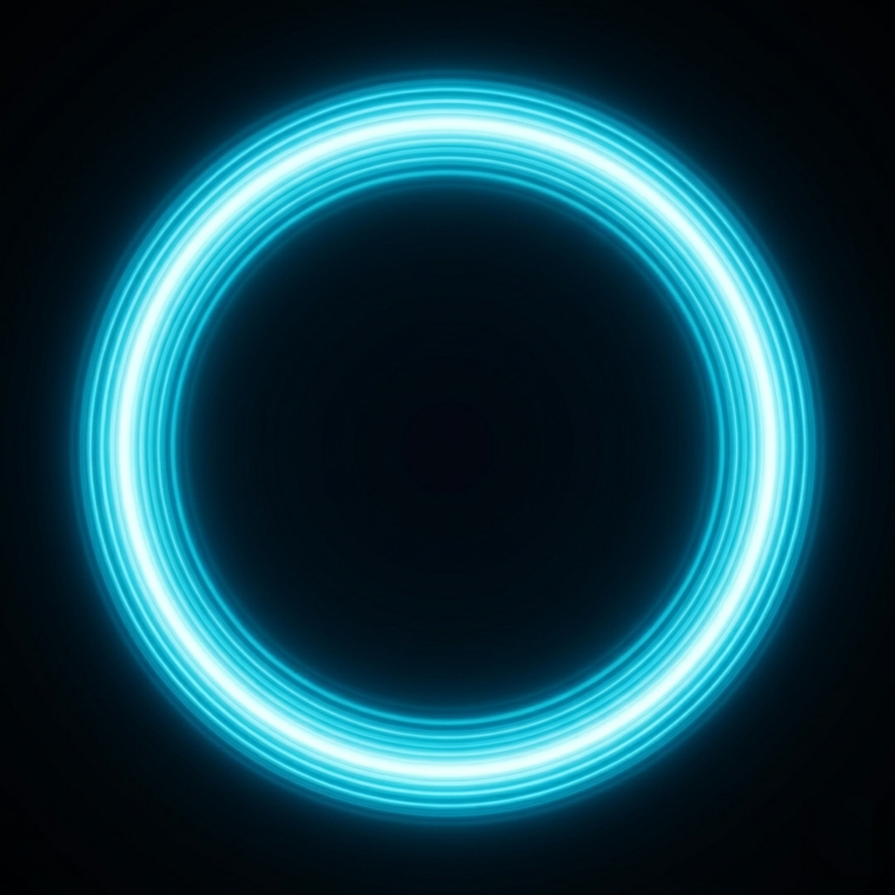

<div align="center">
  
  
  <br/>
  
  <h1 align="center">Aura</h1>
  <p align="center">
    <strong>A premium ambient workspace for macOS</strong>
  </p>
  
  <p align="center">
    
    
    
  </p>
</div>

<br/>

> **Aura** is a production-grade macOS application that pairs immersive, layered soundscapes with dynamic desktop wallpapers to elevate user focus, relaxation, and productivity. Built natively for macOS using the latest Apple platform design guidelines, Aura envelops your workspace in a stunning **Liquid Glass** aesthetic.

## ✨ Features

### 🌊 Liquid Glass Interface
Experience a beautifully crafted, translucent user interface. Aura deeply integrates with macOS 16+ `glassEffect` APIs to provide an adaptive, frosted-glass look that bleeds your desktop environment into the app controls seamlessly.

### 🎧 Ambient Sound Mixer
Sculpt your perfect audio environment. Mix and match individual audio layers with precision:
- 🌧️ **Rain & Storms**
- 🍃 **Forest & Wind**
- ☕ **Cafe Ambience**
- 🌊 **Ocean Waves & Streams**
- 📻 **Brown Noise & Hum**

### 🖼️ Dynamic Wallpapers
Transform your desktop background based on your current mood:
- **Animated Scenes:** High-quality video loops ranging from deep focus geometry to relaxing waterfalls.
- **Generative Zen:** Programmatic SwiftUI visualizations like *Galaxy*, *Pendulum*, *Prism*, and *Stardust* that react and breathe in real-time.
- **Dynamic Quotes:** Keep motivated with elegant, animated typographic backgrounds.
- **Interactive Websites:** Pin live, functional websites directly to your desktop as a wallpaper.

### ⚡ Command Palette & Menu Bar
Stay in the flow. Hit `⌘K` to instantly search and switch moods, or access quick controls from the unobtrusive Menu Bar popover.

---

## 🛠️ Architecture

Aura is built on a robust, modern Swift architecture utilizing strict concurrency (`@MainActor`), `@Observable` state management, and decoupled engine services:

- **`AppModel`**: The central nervous system and dependency injection container.
- **`MoodEngine`**: Manages the catalog of built-in and user-generated moods.
- **`WallpaperEngine`**: Handles seamless transitions between `AVPlayerView`, `NSViewRepresentable` WebViews, and native SwiftUI generative art.
- **`SoundEngine`**: Powered by `AVAudioEngine` for gapless looping and crossfading of multi-channel audio layers.

## 🚀 Getting Started

### Prerequisites
- **macOS 16.0** or later.
- **Xcode 16+** with Swift 6 support.

### Installation
1. Clone the repository:
   ```bash
   git clone https://github.com/yourusername/Aura.git
   ```
2. Open `Aura.xcodeproj` in Xcode.
3. Select the **Aura** scheme and target your Mac.
4. Hit `⌘R` to build and run.

---

<div align="center">
  <p><i>Crafted with focus and Liquid Glass.</i></p>
</div>